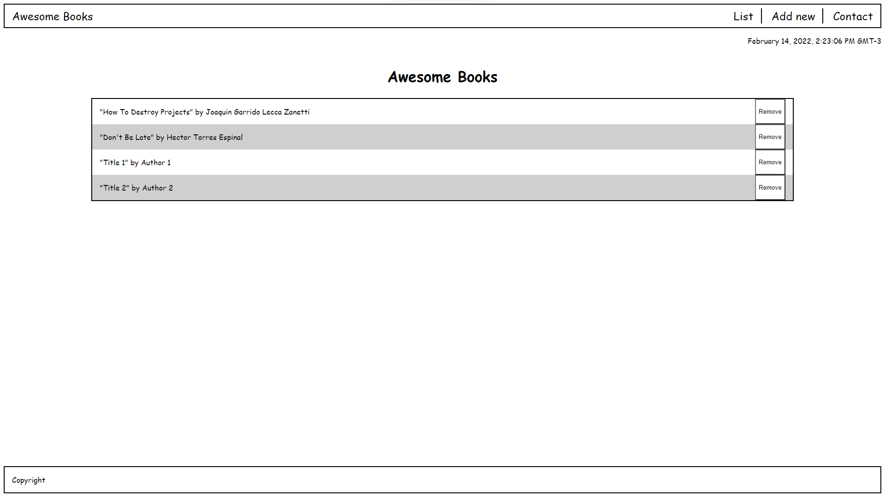

# Awesome Books With ES6

>  This project is to re-build the Awesome Books project using ES6 syntax and divide the code into modules.

## Built With

- HTML
- CSS
- JavaScript
- Linters

## Live Demo

[Live Demo Link](https://ryxtor.github.io/awesome-books-with-es6/)

## Author

👤 **Lucas Bonnefon**

- GitHub: [@ryxtor](https://github.com/ryxtor)
- Twitter: [@ryxtor](https://twitter.com/ryxtor)
- LinkedIn: [Lucas Bonnefon](https://www.linkedin.com/in/lucas-bonnefon-074a01134/)

## 🤝 Contributing

Contributions, issues, and feature requests are welcome!

Feel free to check the [issues page](https://github.com/ryxtor/awesome-books-with-es6/issues).

## Show your support

Give a ⭐️ if you like this project!

## 📝 License

This project is [MIT](./MIT.md)licensed.